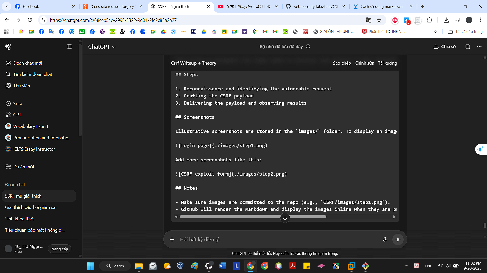

#hehehehehe

---

#CSRF
---
#What is the impact of a CSRF attack?
---
#How does CSRF work?
POST /email/change HTTP/1.1
Host: vulnerable-website.com
Content-Type: application/x-www-form-urlencoded
Content-Length: 30
Cookie: session=yvthwsztyeQkAPzeQ5gHgTvlyxHfsAfE

email=wiener@normal-user.com

With these conditions in place, the attacker can construct a web page containing the following HTML:

---
while web of attacker can be

---

#LAB

